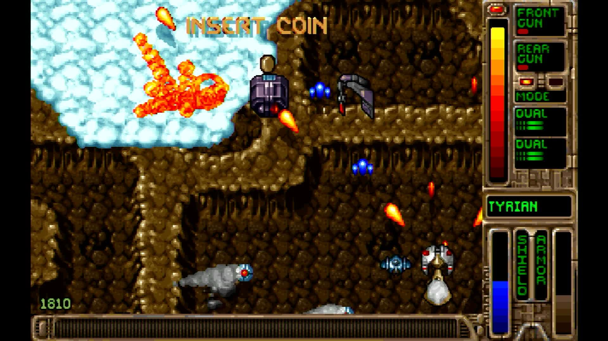

# pi-opentyrian

**OpenTyrian — the open-source port of the DOS shooter Tyrian — running
directly on a Raspberry Pi with no operating system.** The board powers on and
the game is what boots: no Linux, no desktop, no launcher, and nothing else
running beside it.

It builds for the Raspberry Pi 3, Pi 4 and Pi 5, all three from one source
tree.



*Captured from the Pi 5's HDMI output. The board is running this image and
nothing else — no kernel underneath it, no window system, no launcher.*

## What this is

[OpenTyrian](https://github.com/opentyrian/opentyrian) is an ordinary SDL2
application, written in C. This repository is the thin layer that lets it run
with nothing underneath: a [Circle](https://github.com/rsta2/circle) kernel
that brings the board up, and
[circle-libsdl2](https://github.com/Xalior/circle-libsdl2), an SDL2
implementation built on Circle's bare-metal drivers.

The game's own source is not copied or modified here. It is a submodule,
pinned at an upstream commit, and the build reads it without ever writing to
it.

## What works

The game plays, with its music: Tyrian's soundtrack was written for an OPL
chip, and the game emulates one rather than needing the hardware.

Network play is the one thing missing — the two-player mode is not built, so
this is single player.

## The data files you have to supply

**This repository contains no game data and cannot be run without it.**
OpenTyrian is the game's program; the graphics, sounds, levels and music data
belong to Tyrian itself and are not distributed here. Building the images does
not download it, and neither does writing a card.

```sh
make media
```

fetches the one archive this game needs — `tyrian21.zip`, the Tyrian 2.1 data
files, levels, ships, sound and the rest — from
`https://camanis.net/tyrian/tyrian21.zip`. Epic MegaGames, the game's original
developer, released that data as freeware in 2004, and OpenTyrian's own
upstream README names this exact URL as the freeware source. camanis.net is a
plain, unauthenticated file listing: no login, no paywall, no click-through
gate.

The download is checked against a SHA256 and MD5 computed from this project's
own fetch — no independently published checksum for this archive exists, so
neither one is an authoritative reference the way, say, Doom's shareware MD5
is. They only prove that a later fetch produced identical bytes. The archive
is unpacked into `media/tyrian21/`, and `make card` copies it from there onto
the card. Running `make media` again re-verifies what is already there rather
than downloading it a second time.

Nothing about obtaining the data involves working around a licence, a payment
or a copy protection scheme. If a source asks you to do any of those things,
it is the wrong source — and if a fetch ever needed a browser or a login
instead of a plain download, this target would say so rather than reach for
one.

## Building

You need a Linux or macOS machine, GNU make, and the Arm GNU toolchain for
`aarch64-none-elf` (release 15.2.Rel1). Put its `bin` directory on your `PATH`,
or unpack it into `toolchains/` in this repository.

```sh
git clone --recursive https://github.com/Xalior/pi-opentyrian.git
cd pi-opentyrian
make deps       # long: builds newlib and libc++ from source, once per board
make kernels    # the three board images
make verify     # confirms each image exists and is not empty
```

`make deps` is the slow step, and it is slow once. It builds a complete C and
C++ world for each board, because each board's world is compiled for its own
processor.

Each of those worlds needs the LLVM source tree that libc++ is built from. By
default a copy is fetched next to this repository. If you build several
projects of this kind, set `CIRCLE_LLVM` to one shared checkout and they will
all use it instead of fetching their own:

```sh
make deps CIRCLE_LLVM=/path/to/shared/llvm-checkout
```

The images land in `host/build/<board>/`:

| Board | Image |
|---|---|
| Pi 3 | `host/build/rpi3/kernel8.img` |
| Pi 4 | `host/build/rpi4/kernel8-rpi4.img` |
| Pi 5 | `host/build/rpi5/kernel_2712.img` |

## Putting it on a card

```sh
make card
```

This stages a complete card into `build/sd-card/`: the Raspberry Pi firmware,
the three kernel images, the boot configuration, and — if `make media` has
already been run — the Tyrian data files, copied into `games/tyrian/`, the
directory the kernel enters before the game starts. `make card` never
downloads anything itself; run without `media/` populated, it stages a real
card and says that `games/tyrian/` is empty.

`tools/mkcard` can also write a mounted card directly:

```sh
tools/mkcard /Volumes/PI-TYRIAN
```

Every file it downloads is checked against a recorded hash, so the same
repository state always produces the same card.

## Controls

OpenTyrian is played entirely from the keyboard. Plug a USB keyboard into the
board. The default keys are the game's own:

| Key | Action |
|---|---|
| Arrow keys | move the ship |
| Space | fire |
| Enter | change rear weapon mode |
| Ctrl and Alt | fire the left and right sidekicks |
| Escape | menu |

The bindings can be changed in the game's own options menu, and are saved to
the card.

## Licence

GPL-3.0. OpenTyrian is GPL-2.0-or-later and Circle is GPL-3.0; this layer
takes the later of the two so the whole may be distributed together. See
`LICENSE`.

Tyrian's data files are the original developers' freeware release and are
covered by their own terms, not by this licence. They are not distributed
here.
